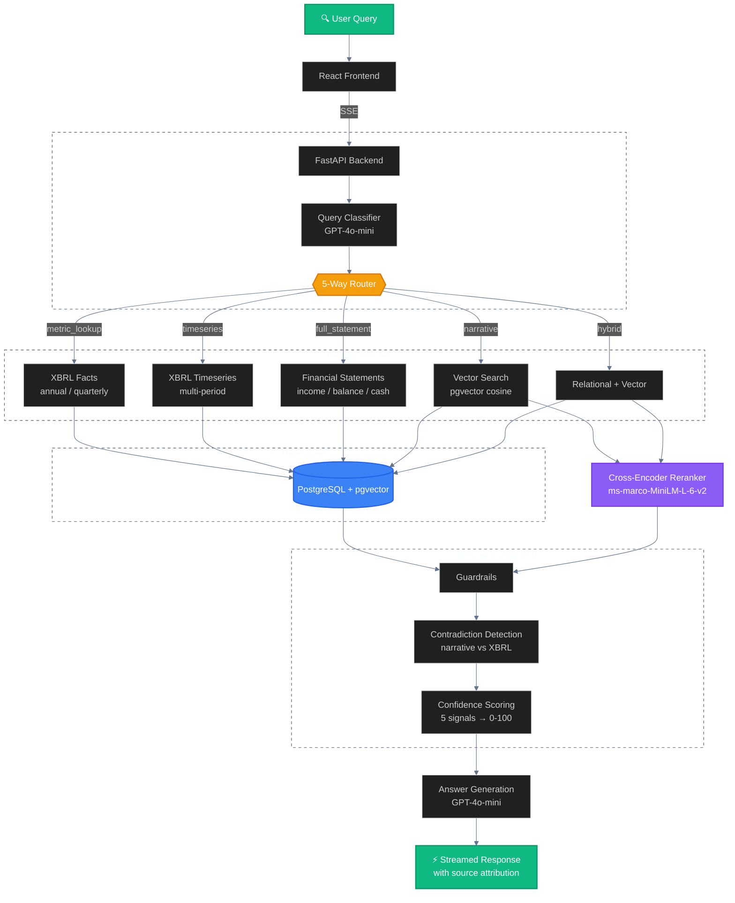
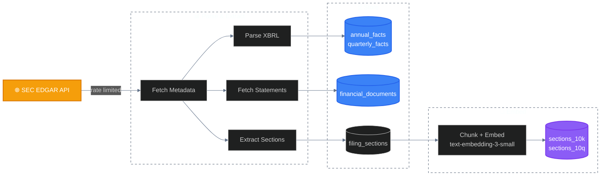

# SEC Filing Intelligence Engine

> **Query SEC filings in plain English.** Structured XBRL data + vector search over filing narratives — answers in seconds, not hours.

**Live Demo:**  ·

## Why I Built This

### The problem

Try answering this:

> *"Compare revenue of AAPL vs MSFT 2023 — what contributed the most to revenue generation for each company?"*

Sounds simple. Here's what it actually takes:

**If you do this manually:**

1. Go to [SEC EDGAR](https://www.sec.gov/cgi-bin/browse-edgar?action=getcompany)
2. Search for Apple's FY2023 10-K filing
3. Scroll through **80+ pages** of legal boilerplate
4. Find the Consolidated Statements of Operations — extract total revenue
5. Scroll further to the segment reporting footnotes — figure out which segment (iPhone? Services?) drove the most revenue
6. **Now repeat the entire process for Microsoft:**
   - Find MSFT's FY2023 10-K
   - Extract total revenue
   - Locate segment reporting (Intelligent Cloud vs Productivity vs Personal Computing)
   - Normalize for fiscal year differences (Apple ends in September, Microsoft ends in June)
   - Cross-check management commentary in MD&A
   - Make sure the numbers actually tie to the XBRL data

That's **30–60 minutes** of manual work. For one question.

**What this engine returns in ~5 seconds:**

| | Apple (AAPL) | Microsoft (MSFT) |
|---|---|---|
| **FY2023 Revenue** | $383.29B | $211.91B |
| **Top segment** | iPhone — $200.58B (52%) | Microsoft Cloud — $137.4B (65%) |
| **#2 segment** | Services — $85.20B (22%) | Office Commercial — $69.27B (33%) |

Plus source citations linking directly to the SEC filings, a confidence score, and contradiction detection — all streamed in real time.

### The core insight

SEC filings contain **two fundamentally different types of information**:

| Type | Examples | Right retrieval method |
|------|----------|----------------------|
| **Structured data** | Revenue, net income, EPS, total assets | Relational DB queries over parsed XBRL facts |
| **Unstructured narrative** | Risk Factors, MD&A, Business descriptions | Vector similarity search + reranking |

Answering real analyst questions often requires **both simultaneously** — and each needs a completely different retrieval strategy. One-size-fits-all RAG doesn't work here.

### What this engine does differently

- **Structured data first** — Financial metrics come from XBRL facts via indexed relational queries, not from extracting numbers out of prose
- **Vector search only where it belongs** — Narrative questions use pgvector embeddings + cross-encoder reranking across 134K+ filing chunks; precise metrics never touch the embedding pipeline
- **Domain complexity handled, not hidden**
  - NVIDIA's fiscal year ends in January (FY2024 = Feb 2023–Jan 2024)
  - XBRL concept tags get renamed across years (`us-gaap:Revenues` → `us-gaap:RevenueFromContractWithCustomerExcludingAssessedTax`)
  - Q4 data doesn't exist in SEC filings — derived by subtracting Q1–Q3 from the annual total
- **Trust built in, not bolted on**
  - 0–100 confidence score from 5 weighted signals
  - Direct source links to the filing on sec.gov
  - Contradiction detection: flags when narrative claims conflict with actual XBRL numbers
- **5 specialized retrieval routes** — The engine classifies each query and routes to the right pipeline (metric lookup, timeseries, full statement, narrative search, or hybrid)

## Architecture



### Data Ingestion Pipeline



For detailed documentation, see:
- [System Architecture](docs/architecture.md) - Component design, data flow, guardrails
- [Database Design](docs/database.md) - Table schemas, indexes, vector search, data volumes
- [Retrieval Routes](docs/retrieval-routes.md) - How each query route works with examples

## Features

- **Intelligent Query Routing** - Classifies queries and routes to the optimal retrieval strategy
- **5 Retrieval Pipelines** - Metric lookup, timeseries, full statements, narrative search, and hybrid
- **Semantic Search** - Vector similarity search over 10-K/10-Q sections using pgvector embeddings
- **XBRL Data Extraction** - Structured financial data from SEC EDGAR XBRL filings
- **Confidence Scoring** - Investor-grade confidence tiers with signal breakdown
- **Contradiction Detection** - Identifies conflicting data across sources
- **Source Attribution** - Every answer links back to SEC EDGAR filings
- **Streaming UI** - Real-time classification, retrieval plan, and answer streaming via SSE
- **Cost Tracking** - Per-query OpenAI token usage and cost estimates

## Tech Stack

| Layer | Technology |
|-------|-----------|
| Frontend | React, Custom CSS |
| Backend | FastAPI, Python |
| Database | PostgreSQL + pgvector |
| Embeddings | OpenAI `text-embedding-3-small` (1536 dims) |
| Reranking | `cross-encoder/ms-marco-MiniLM-L-6-v2` |
| LLM | GPT-4o-mini |
| Data Source | SEC EDGAR (XBRL + full filings) |

## Coverage

**Tickers:** AAPL, MSFT, NVDA, AMZN, GOOGL, META, BRK-B, LLY, AVGO, JPM

**Filings:** 10-K (annual) and 10-Q (quarterly) from 2010 to present

## Project Structure

```
sec_rag_system/
├── api_server.py              # FastAPI server (SSE streaming + REST)
├── rag_query.py               # Query engine: classifier, router, retrieval, generation
├── config.py                  # Tickers, years, fiscal year mappings
├── guardrails.py              # Retrieval filtering + confidence scoring
├── guardrails.yaml            # Guardrail thresholds and config
├── chunk_and_embed.py         # Section chunking + OpenAI embeddings
├── xbrl_to_postgres.py        # XBRL parsing + PostgreSQL storage
├── fetch_financials_to_postgres.py  # Financial statement fetching
├── filing_sections.py         # 10-K/10-Q section extraction
├── section_vector_tables.py   # pgvector table setup
├── backfill_pipeline.py       # Unified data ingestion pipeline
├── requirements.txt           # Python dependencies
├── railway.toml               # Railway deployment config
├── Procfile                   # Process start command
└── frontend/                  # React frontend
    └── src/
        └── App.js             # Main UI with streaming, charts, confidence display
```

## Local Development

### Prerequisites

- Python 3.11+
- PostgreSQL 17 with pgvector extension
- Node.js 18+

### Setup

```bash
# Clone
git clone https://github.com/Ashu290905/Final-Financial-Analysis-Engine
cd financial-intelligence-system

# Backend
python -m venv .venv
source .venv/bin/activate
pip install -r requirements.txt

# Create .env
cat > .env << 'EOF'
OPENAI_API_KEY=sk-...
PG_HOST=localhost
PG_PORT=5432
PG_USER=your_user
PG_PASSWORD=your_password
PG_DATABASE=sec_filings
EMBEDDING_MODEL=text-embedding-3-small
EMBEDDING_DIMENSION=1536
EOF

# Start backend
uvicorn api_server:app --host 0.0.0.0 --port 8000

# Frontend (separate terminal)
cd frontend
npm install
npm start
```

### Data Ingestion

```bash
# Run the backfill pipeline to populate the database
python backfill_pipeline.py
```

## Deployment

Deployed on **Railway** (backend + PostgreSQL) and **Vercel** (frontend).

| Component | Service |
|-----------|---------|
| Frontend | [Vercel](https://vercel.com) (free) |
| Backend | [Railway](https://railway.app) ($5/mo Hobby) |
| Database | Railway PostgreSQL (pgvector Docker image) |

### Environment Variables (Railway)

| Variable | Description |
|----------|-------------|
| `DATABASE_URL` | PostgreSQL connection string (auto-parsed into PG_* vars) |
| `OPENAI_API_KEY` | OpenAI API key |
| `FRONTEND_URL` | Vercel frontend URL (for CORS) |
| `EMBEDDING_MODEL` | `text-embedding-3-small` |
| `EMBEDDING_DIMENSION` | `1536` |

### Environment Variables (Vercel)

| Variable | Description |
|----------|-------------|
| `REACT_APP_BACKEND_URL` | Railway backend URL |

## API Endpoints

| Method | Endpoint | Description |
|--------|----------|-------------|
| POST | `/query/stream` | SSE streaming query (classification + plan + result) |
| POST | `/query` | Non-streaming query |
| GET | `/health` | Health check |

## Example Queries

- "What was Apple's revenue in 2023?"
- "How has NVIDIA revenue changed from 2020 to 2024?"
- "Compare net income AAPL vs MSFT 2023"
- "What are the key risk factors in Meta's latest 10-K?"
- "Show JPMorgan balance sheet for 2023"

## Future Improvements

### Caching with Redis

The current system has no caching layer — every query hits PostgreSQL and OpenAI regardless of whether the same question has been asked before. Two caching strategies would dramatically reduce latency and cost:

**Exact query cache**: Normalize the query (lowercase, strip whitespace, expand ticker aliases) and store the full response in Redis with a TTL of 24 hours. "Apple revenue 2023" and "AAPL revenue 2023" resolve to the same cache key. For a portfolio demo, this means the first visitor pays the OpenAI cost; every visitor after gets a ~50ms response instead of ~5 seconds.

**Semantic cache**: Embed the incoming query and search Redis for cached responses within a cosine similarity threshold (e.g. 0.95). "What was Apple's 2023 revenue?" and "How much did Apple make in FY2023?" are semantically identical but would miss an exact cache. A semantic cache using Redis Stack's vector search module would catch these near-duplicate queries. Estimated hit rate improvement: 40–60% on repeated usage patterns.

**Query embedding cache**: Even on cache misses, the query embedding itself (generated via OpenAI's API) can be cached in Redis keyed by normalized query text. This eliminates redundant embedding API calls on re-runs and costs less than $0.001 per 1000 cached queries.

### Scalability

**Ticker coverage expansion**: The current system covers 10 tickers (AAPL, MSFT, NVDA, AMZN, GOOGL, META, BRK-B, LLY, AVGO, JPM). Scaling to the full S&P 500 would require partitioned PostgreSQL tables by ticker range to maintain query performance, HNSW vector indexes in place of IVFFlat (better recall/latency at 5M+ embeddings), and a distributed ingestion pipeline using Celery + Redis to parallelize SEC EDGAR fetching across tickers while respecting per-IP rate limits.

**Incremental embedding updates**: Currently re-embedding requires reprocessing entire sections. A hash-based change detection layer would skip unchanged sections on re-ingestion, reducing embedding API costs by 80%+ for incremental updates when new filings are published.

**Materialized views for timeseries**: Pre-computing common aggregations (revenue by ticker by year) as PostgreSQL materialized views would eliminate repeated joins for the most frequent query pattern, cutting response time for timeseries queries from ~800ms to ~50ms.

### Broader Filing Coverage

**Additional filing types**: DEF 14A (proxy statements) would enable governance queries — executive compensation, board composition, shareholder proposals. 8-K (current reports) would enable event-driven queries like earnings surprises and material announcements. S-1 filings would add IPO prospectus data with historical risk factors not present in subsequent 10-K filings.

**Agentic retrieval**: The current 5-route system uses a single classification step. A more robust approach would use an agent loop — classify, retrieve, evaluate result quality, and re-retrieve with a different strategy if the initial results are insufficient. For example, if `metric_lookup` returns no XBRL data for a valid concept, the agent would autonomously fall back to `narrative` search rather than returning an empty answer.

### RAG Pipeline Enhancements

**Multi-hop reasoning**: Queries like "How did Apple's supply chain risks change after COVID?" require retrieving 2019 risk factors, 2020–2021 risk factors, and synthesizing the delta across time. A dedicated multi-hop retrieval step would explicitly construct "before" and "after" context windows rather than relying on the LLM to infer temporal ordering from a flat chunk list.

**Fine-tuned reranker**: The current `ms-marco-MiniLM-L-6-v2` cross-encoder is trained on general web search data. Fine-tuning on (query, SEC filing chunk, relevance label) pairs from financial analyst workflows would improve precision on domain-specific terminology — particularly for ambiguous terms like "provisions" (accounting provision vs. legal provision vs. loan loss provision) that appear frequently across different filing sections with completely different meanings.

### Evaluation & Monitoring

**Automated evaluation suite**: A benchmark dataset of (query, expected answer, expected route, expected sources) pairs would enable regression testing of the full pipeline. A nightly eval run against 100 benchmark queries — scoring route accuracy, answer correctness, and confidence calibration — would catch retrieval regressions before they reach users.

**Confidence calibration**: The current confidence weights are hand-tuned. With a labeled evaluation dataset, the weights could be calibrated empirically: when the system returns "High Confidence," what fraction of answers are actually correct? Calibration curves would reveal systematic over- or under-confidence by route type and guide weight adjustments in `guardrails.yaml`.
